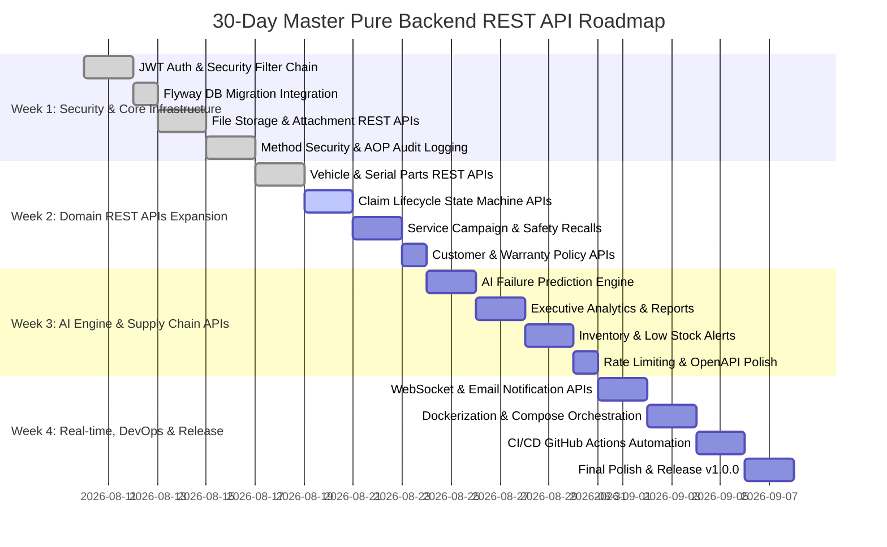

# Master 30-Day Development Roadmap (Pure Backend REST API)

---

## Progress Tracking

### 🟢 WEEK 1: Security & Core Infrastructure (Days 1 - 7) — COMPLETED ✅
- [x] **Day 1 - 2**: Stateless JWT Bearer Token Authentication (`JwtTokenProvider`, `JwtAuthenticationFilter`, `/api/v1/auth/login`, `/api/v1/auth/me`).
- [x] **Day 3**: Flyway Database Migrations (`V1__init_schema.sql` initialized PostgreSQL schema).
- [x] **Day 4**: File Storage Service & Diagnostic Attachment REST APIs (`/api/v1/claims/{id}/attachments`, download & delete).
- [x] **Day 5**: Fine-grained Method Security (`@PreAuthorize`) & AOP Automated Audit Trail (`@Auditable`).
- [x] **Day 6 - 7**: End-to-End Integration Testing (`AuthIntegrationTest`, `AttachmentAndAuditIntegrationTest`).

---

### 🔵 WEEK 2: Domain REST APIs Expansion (Days 8 - 15) — IN PROGRESS 🔄
- [x] **Day 8 - 9: Vehicle & Serial Parts REST APIs** ✅
  - [x] Vehicle registration, update, VIN lookup, odometer patch (`/api/v1/sc/vehicles`).
  - [x] Installed serial parts tracking with auto warranty dating (`/api/v1/sc/vehicles/{id}/parts`).
  - [x] DTO mapping via `VehicleMapper` and full `@JsonIgnore` protection.
  - [x] Comprehensive unit test suites (`VehicleServiceTest`, `VehicleControllerTest`, `VehiclePartRestControllerTest`).
- [ ] **Day 10 - 11: Claim Lifecycle State Machine REST APIs**
  - [ ] `POST /api/v1/sc/claims` (Create warranty claim).
  - [ ] `POST /api/v1/evm/claims/{id}/approve` & `reject` (EVM Staff review).
  - [ ] `POST /api/v1/sc/claims/{id}/assign` & `complete` (Technician work order).
- [ ] **Day 12 - 13: Service Campaign & Safety Recall REST APIs**
  - [ ] `POST /api/v1/evm/campaigns` (Create safety recall/TSB).
  - [ ] `GET /api/v1/evm/campaigns/{id}/affected-vehicles` (Filter by VIN/Model/Year).
  - [ ] `POST /api/v1/sc/appointments` (Schedule recall service).
- [ ] **Day 14: Customer & Warranty Policy REST APIs**
  - [ ] Customer profile management (`/api/v1/sc/customers`).
  - [ ] OEM warranty policy management (`/api/v1/evm/policies`).
- [ ] **Day 15: Week 2 Review & Integration Tests**

---

### 🟣 WEEK 3: AI Engine, Analytics & Supply Chain (Days 16 - 22)
- [ ] **Day 16 - 17**: AI Failure Prediction Service (`/api/v1/analytics/predict/{vin}`).
- [ ] **Day 18 - 19**: Executive Analytics & Warranty Cost Reports (`/api/v1/analytics/reports/*`).
- [ ] **Day 20 - 21**: Parts Inventory & Regional Stock Allocation (`/api/v1/sc/inventory`, `/api/v1/evm/allocations`).
- [ ] **Day 22**: API Rate Limiting (Bucket4j) & OpenAPI Swagger Documentation Polish.

---

### 🔴 WEEK 4: Real-time, DevOps & Release (Days 23 - 30)
- [ ] **Day 23 - 24**: WebSocket (STOMP) Real-time Claim Events & Email Notification Dispatcher.
- [ ] **Day 25 - 26**: Docker Multi-stage Build & `docker-compose.yml` (App + PostgreSQL 17 + Redis).
- [ ] **Day 27 - 28**: CI/CD GitHub Actions Workflow (`.github/workflows/ci.yml`).
- [ ] **Day 29**: Full Security & Penetration Testing Execution.
- [ ] **Day 30**: Official Release `v1.0.0-RELEASE`.
