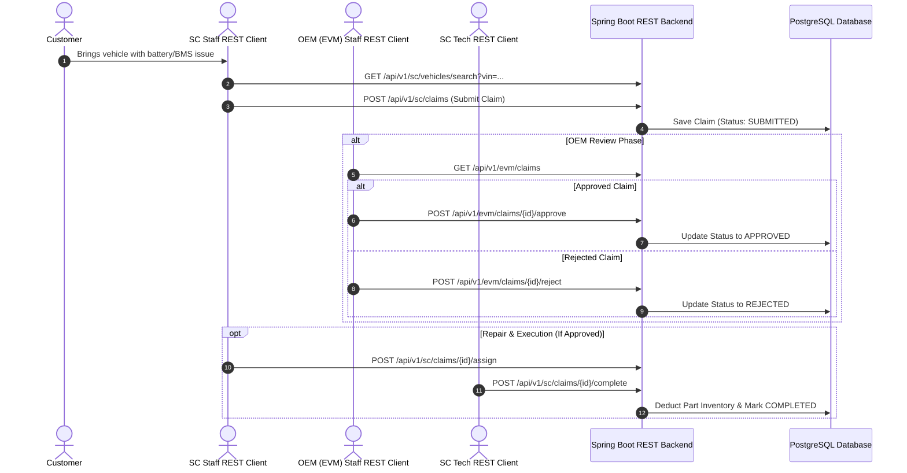

# Enterprise Electric Vehicle (EV) Warranty System - Headless REST API Backend

[](https://openjdk.org/projects/jdk/21/)
[](https://spring.io/projects/spring-boot)
[](https://www.postgresql.org/)
[](LICENSE)
[](http://localhost:8080/swagger-ui.html)

An enterprise-grade EV Warranty Management & Telemetry Analytics **Headless REST API Backend** platform designed to connect Original Equipment Manufacturers (OEMs) with authorized Service Centers (SCs). Built on modern Java 21 LTS and Spring Boot 3.2, the system provides pure JSON REST APIs for warranty claim lifecycles, supply chain inventory, safety recalls, and AI-driven predictive maintenance.

---

## Table of Contents

1. [Executive Summary](#1-executive-summary)
2. [Key Features](#2-key-features)
3. [Real-World Business Workflows](#3-real-world-business-workflows)
4. [System Architecture & Package Layout](#4-system-architecture--package-layout)
5. [Technology Stack](#5-technology-stack)
6. [Getting Started & Installation](#6-getting-started--installation)
7. [Test Accounts & Access Matrix](#7-test-accounts--access-matrix)
8. [API Documentation & Swagger UI](#8-api-documentation--swagger-ui)
9. [License](#9-license)

---

## 1. Executive Summary

As the Electric Vehicle ecosystem rapidly expands, managing battery degradation, high-voltage powertrain warranties, component failures, and safety recalls requires centralized data exchange between automakers and repair centers.

**EV Warranty System** provides:
* **OEM REST APIs**: Centralized approval workflow for warranty reimbursements, part catalogs, and safety recall broadcasts.
* **Service Center REST APIs**: Seamless claim filing, vehicle history tracking, customer appointments, and inventory allocation.
* **AI Predictive Risk Engine**: Statistical analysis of fleet failure trends, battery health parameters, and mileage thresholds to forecast component breakdowns before catastrophic failure occurs.

---

## 2. Key Features

- **Stateless Role-Based REST Access Control**: Fine-grained security for `ADMIN`, `EVM_STAFF`, `SC_STAFF`, and `SC_TECHNICIAN`.
- **AI Failure Prediction & Telemetry Risk Scoring**: Heuristic and statistical risk modeling based on mileage, vehicle model history, and component repeat failure rates.
- **End-to-End Warranty Claim Processing**: Multi-stage state machine (`SUBMITTED` -> `UNDER_REVIEW` -> `APPROVED` / `REJECTED` -> `IN_PROGRESS` -> `COMPLETED`).
- **Parts & Supply Chain Inventory**: Real-time stock tracking across authorized service centers with low-stock alerts.
- **Safety Recalls & Service Campaigns**: Target affected VIN ranges and vehicle models with automated repair scheduling.
- **Automatic Data Seeding**: Built-in Java `DataSeeder` automatically initializes sample domain records upon application startup if empty.

---

## 3. Real-World Business Workflows

### Workflow 1: Warranty Claim Lifecycle



---

## 4. System Architecture & Package Layout

The application follows a **Domain-Driven / Feature-Based Modular Architecture** under `com.oem.evwarranty.*`:

```text
com.oem.evwarranty/
├── EvWarrantyApplication.java
│
├── common/                               # Cross-cutting concerns & shared infrastructure
│   ├── config/                           # SecurityConfig, WebConfig, OpenApiConfig, DataSeeder
│   └── exception/                        # ResourceNotFoundException, BusinessLogicException, GlobalExceptionHandler
│
└── domain/                               # Self-contained business domains (Pure REST Controllers)
    ├── analytics/                        # AI Failure Prediction & Dashboard REST APIs
    ├── audit/                            # System Audit Logging REST APIs
    ├── campaign/                         # Service Campaigns & Safety Recalls REST APIs
    ├── claim/                            # Warranty Claims & Policies REST APIs
    ├── customer/                         # Vehicle Owners & Customers REST APIs
    ├── inventory/                        # Parts Catalog & Inventory Stock REST APIs
    ├── user/                             # Authentication & User Management REST APIs
    └── vehicle/                          # Electric Vehicles REST APIs
```

---

## 5. Technology Stack

* **Core Language**: Java 21 (LTS)
* **Backend Framework**: Spring Boot 3.2.0 (Spring REST Web, Spring Data JPA, Spring Security 6)
* **Database**: PostgreSQL 17
* **API Specifications**: OpenAPI 3.0 (Springdoc OpenAPI / Swagger UI)
* **Build Tool**: Apache Maven

---

## 6. Getting Started & Installation

### Prerequisites

* JDK 21 or higher
* PostgreSQL 17 running on `localhost:5432`
* Git

---

### Running the Application

1. Clone the repository:
   ```bash
   git clone https://github.com/KaitoDeus/EV-Warranty-System.git
   cd EV-Warranty-System
   ```

2. Configure database credentials in `src/main/resources/application.properties` (or set environment variables):
   ```properties
   spring.datasource.url=jdbc:postgresql://localhost:5432/postgres
   spring.datasource.username=postgres
   spring.datasource.password=password123
   ```

3. Build and run the Spring Boot REST API application:
   ```bash
   mvn spring-boot:run
   ```

---

## 7. Test Accounts & Access Matrix

| Role | Username | Password | REST API Scope |
| :--- | :--- | :--- | :--- |
| **System Administrator** | `admin` | `password123` | `/api/v1/admin/**` (Full administration) |
| **OEM Manufacturer Staff**| `evmstaff` | `password123` | `/api/v1/evm/**` (Recalls, claims review, part catalog) |
| **Service Center Staff** | `scstaff` | `password123` | `/api/v1/sc/**` (Vehicle intake, claims, customers) |
| **Service Center Tech** | `sctech` | `password123` | `/api/v1/sctech/**`, `/api/v1/ai/**` (AI predictions & diagnostics) |

---

## 8. API Documentation & Swagger UI

When the application is running, test all REST APIs directly via Swagger UI:
* **Interactive Swagger UI**: [http://localhost:8080/swagger-ui.html](http://localhost:8080/swagger-ui.html)
* **OpenAPI JSON Spec**: [http://localhost:8080/v3/api-docs](http://localhost:8080/v3/api-docs)

---

## 9. License

This project is licensed under the **MIT License** - see the [LICENSE](LICENSE) file for details.
