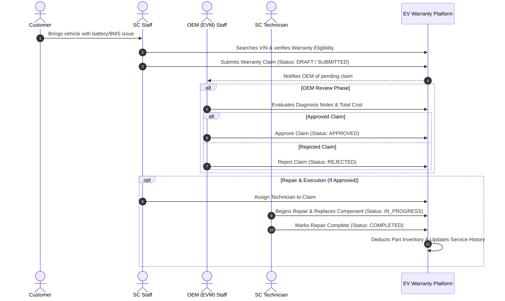
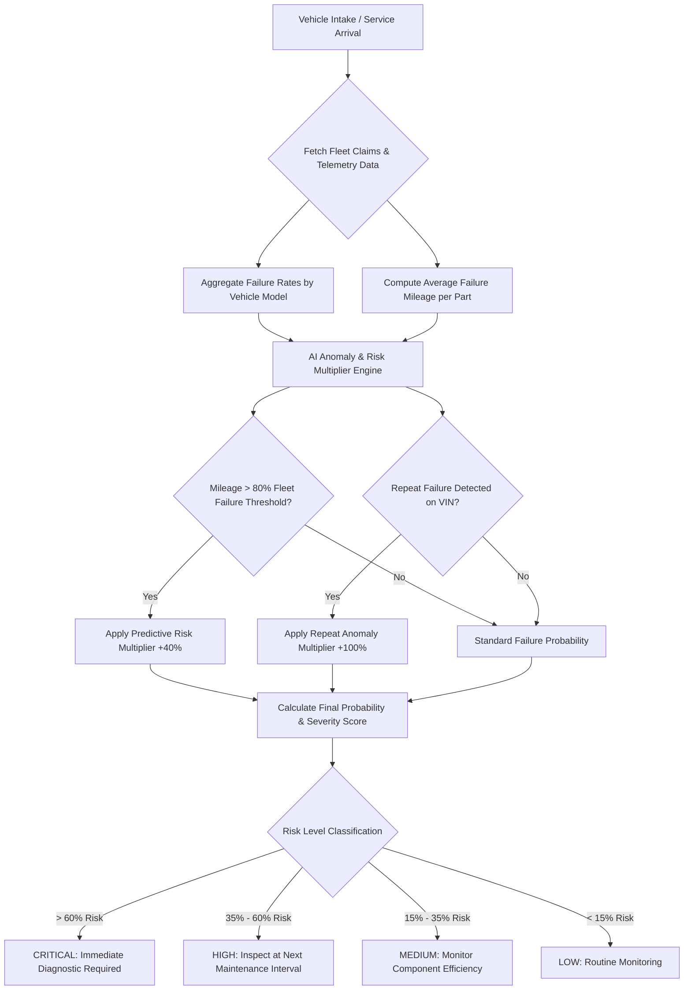
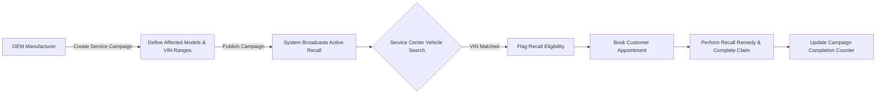

# Enterprise Electric Vehicle (EV) Warranty System

[](https://openjdk.org/projects/jdk/21/)
[](https://spring.io/projects/spring-boot)
[](https://www.postgresql.org/)
[](https://www.docker.com/)
[](LICENSE)
[](http://localhost:8080/swagger-ui.html)

A enterprise-grade EV Warranty Management & Telemetry Analytics platform designed to connect Original Equipment Manufacturers (OEMs) with authorized Service Centers (SCs). Built on modern Java 21 LTS and Spring Boot 3.2, the system streamlines warranty claim lifecycles, supply chain inventory, safety recalls, and AI-driven predictive maintenance.

---

## 📋 Table of Contents

1. [Executive Summary](#1-executive-summary)
2. [Key Features](#2-key-features)
3. [Real-World Business Workflows](#3-real-world-business-workflows)
   - [Workflow 1: Warranty Claim Lifecycle](#workflow-1-warranty-claim-lifecycle)
   - [Workflow 2: AI Predictive Maintenance & Risk Scoring](#workflow-2-ai-predictive-maintenance--risk-scoring)
   - [Workflow 3: Recall Campaign Broadcast & Execution](#workflow-3-recall-campaign-broadcast--execution)
4. [System Architecture & Package Layout](#4-system-architecture--package-layout)
5. [Technology Stack](#5-technology-stack)
6. [Getting Started & Installation](#6-getting-started--installation)
   - [Option A: Docker Compose (Recommended)](#option-a-docker-compose-recommended)
   - [Option B: Manual Local Development](#option-b-manual-local-development)
7. [Test Accounts & Access Matrix](#7-test-accounts--access-matrix)
8. [API Documentation & Swagger UI](#8-api-documentation--swagger-ui)
9. [License](#9-license)

---

## 1. Executive Summary

As the Electric Vehicle ecosystem rapidly expands, managing battery degradation, high-voltage powertrain warranties, component failures, and safety recalls requires centralized data exchange between automakers and repair centers.

**EV Warranty System** provides:
* **OEM Oversight**: Centralized approval workflow for warranty reimbursements, part catalogs, and safety recall broadcasts.
* **Service Center Operational Efficiency**: Seamless claim filing, vehicle history tracking, customer appointments, and inventory allocation.
* **AI Predictive Risk Engine**: Statistical analysis of fleet failure trends, battery health parameters, and mileage thresholds to forecast component breakdowns before catastrophic failure occurs.

---

## 2. Key Features

- 🔐 **Role-Based Access Control (RBAC)**: Fine-grained security for `ADMIN`, `EVM_STAFF`, `SC_STAFF`, and `SC_TECHNICIAN`.
- ⚡ **AI Failure Prediction & Telemetry Risk Scoring**: Heuristic and statistical risk modeling based on mileage, vehicle model history, and component repeat failure rates.
- 📋 **End-to-End Warranty Claim Processing**: Multi-stage state machine (`SUBMITTED` ➔ `UNDER_REVIEW` ➔ `APPROVED` / `REJECTED` ➔ `IN_PROGRESS` ➔ `COMPLETED`).
- 🏬 **Parts & Supply Chain Inventory**: Real-time stock tracking across authorized service centers with low-stock alerts.
- 📢 **Safety Recalls & Service Campaigns**: Target affected VIN ranges and vehicle models with automated repair scheduling.
- 📊 **Real-time Analytics Dashboard**: Role-tailored dashboards powered by interactive charts and OpenAPI endpoints.

---

## 3. Real-World Business Workflows

### Workflow 1: Warranty Claim Lifecycle

The following sequence illustrates how a warranty claim moves from customer intake at a Service Center through OEM review, technician assignment, and final repair completion:



---

### Workflow 2: AI Predictive Maintenance & Risk Scoring

The AI Engine analyzes fleet telemetry and past claim records to detect abnormal component failure trends and generate actionable recommendations:



---

### Workflow 3: Recall Campaign Broadcast & Execution

Automakers broadcast safety recall campaigns for specific vehicle models or VIN lists, enabling automated service appointments at local service centers:



---

## 4. System Architecture & Package Layout

The application follows a **Domain-Driven / Feature-Based Modular Architecture** under `com.oem.evwarranty.*`:

```text
com.oem.evwarranty/
├── EvWarrantyApplication.java
│
├── common/                               # Cross-cutting concerns & shared infrastructure
│   ├── config/                           # SecurityConfig, WebConfig, OpenApiConfig, GlobalModelAdvice
│   └── exception/                        # ResourceNotFoundException, BusinessLogicException, GlobalExceptionHandler
│
└── domain/                               # Self-contained business domains
    ├── analytics/                        # AI Failure Prediction, Reports & Dashboards
    ├── audit/                            # System Audit Logging
    ├── campaign/                         # Service Campaigns & Safety Recalls
    ├── claim/                            # Warranty Claims, Policies & Appointments
    ├── customer/                         # Vehicle Owners & Customers
    ├── inventory/                        # Parts Catalog, Stock Management & Supply Chain
    ├── user/                             # Authentication, Users & Role-Based Access Control
    └── vehicle/                          # Electric Vehicles & Component Telemetry
```

---

## 5. Technology Stack

* **Core Language**: Java 21 (LTS)
* **Backend Framework**: Spring Boot 3.2.0 (Spring MVC, Spring Data JPA, Spring Security 6)
* **Frontend Template Engine**: Thymeleaf + Bootstrap 5 + jQuery
* **Database**: PostgreSQL 17
* **API Specs**: OpenAPI 3.0 (Springdoc OpenAPI / Swagger UI)
* **Build & Containerization**: Apache Maven & Docker Compose

---

## 6. Getting Started & Installation

### Prerequisites

* JDK 21 or higher
* Docker & Docker Compose (Optional, for containerized run)
* Git

---

### Option A: Docker Compose (Recommended)

To launch the full stack (Spring Boot Application + PostgreSQL Database) in detached mode:

1. Clone the repository:
   ```bash
   git clone https://github.com/KaitoDeus/EV-Warranty-System.git
   cd EV-Warranty-System
   ```

2. Start services via Docker Compose:
   ```bash
   docker-compose up -d --build
   ```

3. Access the application at `http://localhost:8080`.

---

### Option B: Manual Local Development

1. Start PostgreSQL database container only:
   ```bash
   docker-compose up -d evwarranty-db
   ```

2. Run the Spring Boot application using Maven:
   ```bash
   mvn spring-boot:run
   ```

3. Access the web interface at `http://localhost:8080`.

---

## 7. Test Accounts & Access Matrix

You can sign in with the following pre-configured credentials to evaluate role-based permissions:

| Role | Username | Password | Access Scope & Operations |
| :--- | :--- | :--- | :--- |
| **System Administrator** | `admin` | `password123` | Full system administration, user management, global dashboards & audit logs |
| **Service Center Staff** | `scstaff` | `password123` | Customer management, vehicle intake, warranty claim creation & appointment booking |
| **Service Center Tech** | `sctech` | `password123` | AI risk prediction analysis, diagnostic execution & repair status updates |
| **OEM Manufacturer Staff**| `evmstaff` | `password123` | Claim approvals/rejections, part catalog, inventory allocation & recall campaigns |

---

## 8. API Documentation & Swagger UI

The system exposes RESTful API endpoints documented via OpenAPI 3.0 specs.

When the application is running, open your browser to access the interactive Swagger UI:
👉 **[http://localhost:8080/swagger-ui.html](http://localhost:8080/swagger-ui.html)**

Raw OpenAPI JSON definition:
👉 **[http://localhost:8080/v3/api-docs](http://localhost:8080/v3/api-docs)**

---

## 9. License

This project is licensed under the **MIT License** - see the [LICENSE](LICENSE) file for details.

```text
Copyright (c) 2026 EV Warranty System Contributors
```
